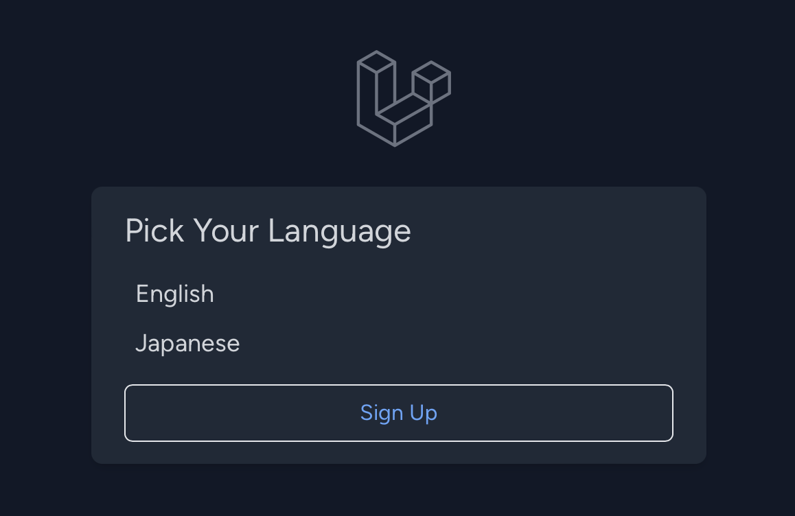
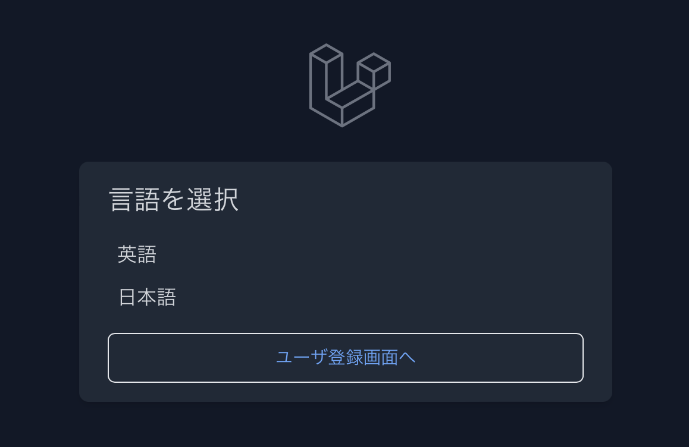

# Language Switcher Sample (言語切り替えサンプル)

This is language switcher Laravel app sample. Laravelの言語切り替えサンプルです🇺🇸🇯🇵

## Installation

```bash
git clone this_repository
cd this_repository
composer install
cp .env.example .env
php artisan key:generate
php artisan migrate

npm install && npm run build

php artisan serve
```

Open [`http://localhost:8000`](http://localhost:8000) in your browser. (ブラウザでURL開いてね)

## Implementation

- Japanese Language files: `lang/ja.json`, `lang/ja/[auth|pagination|passwords|validation].php` (言語ファイル)
- Language Switch Middleware: `app/Http/Middleware/Localization.php` (言語切替ミドルウェア)
- Kernel (Register Language Switch Middleware): `app/Http/Kernel.php` (カーネル：言語切替ミドルウェア登録)
- Route (Language Switcher Route): `routes/web.php` (ルーティング 言語切替ルート)

## Screen Shot

- English (英語)




- Japanese (日本語)

